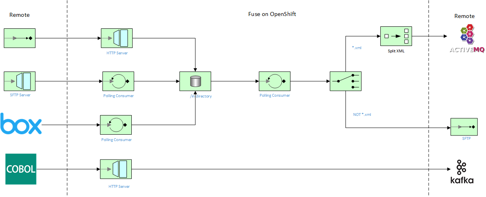

<h1 align="center">Managed File Transfer with Box using Fuse on Openshift</h1>

This project demonstrates a few simple MFT flows using Fuse on Openshift, including connectivity to Box SaaS-based storage:

This flow includes the following services

1. [Flow One: HTTP Upload Endpoint](./http-upload-service)
2. [Flow Two: SFTP Download Endpoint](./sftp-download)
3. [Flow Three: File Split Box Producer](./box-upload-service)
4. [Flow Four: SFTP Push](./sftp-upload)

Prerequisites
==============================

- Openshift 4.3+, Integreatly on RHPDS, or RHMI instance
- Fuse 7.5+ Image Streams (template found [here](https://raw.githubusercontent.com/jboss-fuse/application-templates/master/fis-image-streams.json))
- Fuse Online 7.5+
